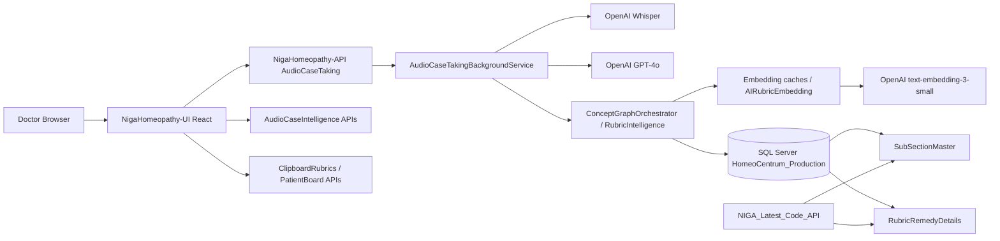
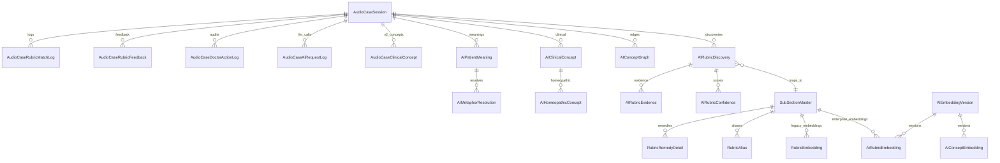

# AI Rubric Engine — Complete System Documentation

**Document type:** Implementation-accurate technical reference (current code only)  
**Generated from:** Live repository inspection (no invented architecture)  
**Primary engine repo:** `NigaHomeopathy-API`  
**Related repos in workspace:** `NigaHomeopathy-UI` (doctor UI), `NIGA_Latest_Code_API` (repertory admin API — no AI engine), `minimal` (unrelated Velzon theme)  
**Convention:** Where something cannot be confirmed from source/SQL, it is marked **`UNKNOWN / NOT FOUND IN CODE`**.  
**Secrets:** Environment/config **names only** — never secret values.

---

## Table of Contents

1. [Project Overview](#1-project-overview)
2. [Repository Structure](#2-repository-structure)
3. [Frontend Architecture](#3-frontend-architecture)
4. [API / Backend Architecture](#4-api--backend-architecture)
5. [AI Rubric Engine](#5-ai-rubric-engine)
6. [Transcript Processing](#6-transcript-processing)
7. [AI / LLM Processing](#7-ai--llm-processing)
8. [Clinical Meaning / Concept Extraction](#8-clinical-meaning--concept-extraction)
9. [Rubric Discovery](#9-rubric-discovery)
10. [Embedding System](#10-embedding-system)
11. [Rubric Matching and Confidence Score](#11-rubric-matching-and-confidence-score)
12. [Rubric Validation](#12-rubric-validation)
13. [Rubric Approval / Rejection](#13-rubric-approval--rejection)
14. [Repertorization](#14-repertorization)
15. [Database Architecture](#15-database-architecture)
16. [Database Relationships](#16-database-relationships)
17. [SQL Queries](#17-sql-queries)
18. [Data Flow](#18-data-flow)
19. [Current AI Rubric Engine Problems](#19-current-ai-rubric-engine-problems)
20. [Example Case Analysis](#20-example-case-analysis)
21. [Complete File Reference](#21-complete-file-reference)
22. [Environment Configuration](#22-environment-configuration)
23. [Deployment Architecture](#23-deployment-architecture)
24. [API → DB → AI Dependency Map](#24-api--db--ai-dependency-map)
25. [Final System Summary](#25-final-system-summary)

---

## 1. Project Overview

### Project name

**NIGA / Niga Homeopathy (HomeoCentrum)** — multi-repo clinical homeopathy platform.

| Repo | Role |
|------|------|
| `NigaHomeopathy-API` | Doctor-facing ASP.NET API + **AI Rubric Engine** (Audio Case Taking / Audio Case Intelligence) |
| `NigaHomeopathy-UI` | React doctor/admin SPA (PatientBoard audio case taking, Rubric Intelligence admin) |
| `NIGA_Latest_Code_API` | Separate **repertory admin** API (`NIGA.Centrum.*`) for SubSection/Remedy CRUD and classic search — **does not contain the AI Rubric Engine** |
| `minimal` | Standalone Velzon theme/landing template — **no Audio Case / AI Rubric code** |

### Purpose of the application

Clinical homeopathy practice software: patient board, case taking, repertory browsing, clipboard/repertorization, materia medica, admin masters, WhatsApp integrations, etc.

### Purpose of the AI Rubric Engine

Convert a doctor–patient consultation **audio recording** (or edited transcript) into:

1. English transcript  
2. Structured clinical extraction (symptoms, summary, conversation roles)  
3. Concept-graph / meaning analysis (V3+)  
4. Suggested repertory rubrics linked to `SubSectionMaster`  
5. Doctor approve/reject feedback + learning signals  
6. Hand-off of approved DB-backed rubrics into the PatientBoard **repertorization** list (UI-side)

### Main business functionality (AI-related)

- Live/file audio upload with consent  
- Whisper transcription/translation to English  
- GPT case extraction  
- Multi-version rubric intelligence (V1 keyword → V2 hybrid → V3 concept graph → enterprise discovery / V7 repertory intelligence)  
- Embedding-based semantic rubric search  
- Clinical validation + hallucination/gender/age/domain gates  
- Doctor feedback learning  
- Admin curation: metaphors, aliases, benchmarks, embedding jobs, monitoring

### Main user types / roles

| Role | Evidence in code |
|------|------------------|
| Doctor | PatientBoard audio case taking; JWT `[Authorize]` on AudioCaseTaking APIs; `DoctorUserId` on session |
| Admin | Rubric Intelligence pages (metaphors, aliases, benchmark); `AudioCaseIntelligenceAdminController` |
| Patient | Subject of session (`PatientId`); not an AI engine user |

Exact role/claim matrix for every endpoint: **partially documented via `[Authorize]`**; fine-grained role names beyond JWT identity are **UNKNOWN / NOT FOUND IN CODE** for audio endpoints specifically.

### Technology stack

| Layer | Technology |
|-------|------------|
| Frontend | React 18.3, CRA (`react-scripts`), Redux Toolkit 2.3, React Router 6.27, Axios, Bootstrap 5.3 / Reactstrap |
| Backend (AI API) | ASP.NET Core **net8.0**, Entity Framework Core (SQL Server), JWT Bearer, Swashbuckle |
| Repertory admin API | ASP.NET Core (`NIGA.Centrum.*`) — shared DB masters |
| Database | Microsoft SQL Server (`HomeoCentrum_Production`) |
| AI / LLM | OpenAI HTTP API: `whisper-1`, `gpt-4o`, `text-embedding-3-small` |
| Embedding / vector | JSON float arrays (1536-dim), in-process cosine similarity — **not** SQL Server native `VECTOR` type |
| Auth | JWT (`Microsoft.AspNetCore.Authentication.JwtBearer`) |
| External services | OpenAI; Azure OpenAI options exist but PreferAzure path is unused by primary processors; WhatsApp Meta (unrelated to AI rubric); Firebase in UI template |

### Hosting / deployment (from repo evidence)

- Frontend `config.js` references production hosts such as `api1.homeocentrum.com`, `api.homeocentrum.com`, `nigaapi.homeocentrum.com` (commented variants).  
- Backend has `publish/` output folders and `launchSettings.json`.  
- No Dockerfile found for the AI API.  
- Formal IIS/Nginx/Azure/AWS deploy docs: **UNKNOWN / NOT FOUND IN CODE** (see §23).

### Important environment / config keys (names only)

```text
ConnectionStrings:DefaultConnection
TokenKey
JWT:ValidAudience
JWT:ValidIssuer
JWT:Secret
OpenAI:ApiKey
OpenAI:BaseUrl
OpenAI:WhisperModel
OpenAI:ChatModel
OpenAI:EmbeddingModel
AzureOpenAI:* (Endpoint, deployments, PreferAzureOverOpenAi, …)
AudioCaseTaking:*
RubricIntelligence:*
AiEmbeddingInfrastructure:*
WhatsAppMeta:* (unrelated to rubric AI)
```

ASP.NET Core nested env override convention applies (e.g. `OpenAI__ApiKey`). Explicit `Environment.GetEnvironmentVariable` mapping for these sections: **UNKNOWN / NOT FOUND IN CODE**.

### Architecture diagram (components that exist)



---

## 2. Repository Structure

### 2.1 `NigaHomeopathy-API` (AI engine home)

```text
NigaHomeopathy-API/
├── Niga-Web/                 # ASP.NET host, controllers, appsettings
├── Niga-Domain/              # Domain services, EF entities, DTOs, DI
├── Niga-Domain.Tests/        # RubricIntelligence + embedding tests
├── Database/Scripts/         # AudioCase + AI embedding SQL
├── Scripts/                  # Misc ops scripts
├── docs/                     # Some embedding phase docs
├── publish/                  # Published build output
└── Niga.sln
```

#### Important folders

| Folder | Purpose | Important contents | Relates to |
|--------|---------|-------------------|------------|
| `Niga-Web/Controllers/` | HTTP API surface | `AudioCaseTakingController`, `AudioCaseIntelligenceController`, `AudioCaseIntelligenceAdminController`, `AudioCaseIntelligenceV3Controller`, `AiEmbeddingInfrastructureController`, `AiMonitoringDashboardController`, `ClipboardRubricsController` | UI helpers |
| `Niga-Domain/Services/AudioCaseIntelligence/` | Core AI pipeline | Orchestration, V3 engines, merging, validation, embeddings, enterprise, V6/V7, learning | Background worker |
| `Niga-Domain/Services/AiEmbeddingInfrastructure/` | V4 enterprise embeddings | Build, incremental refresh, semantic search, cache warmup | Hosted services |
| `Niga-Domain/Services/AudioCaseAiProcessor.cs` | Whisper + GPT extract/suggest | Transcription, extraction prompts, Jaccard similarity | Session processing |
| `Niga-Domain/Services/AudioCaseTakingBackgroundService.cs` | Job queue worker | Dequeues `ProcessAudio` / reanalyze | Upload |
| `Niga-Domain/Repositories/AudioCaseTakingService.cs` | Session lifecycle | Upload, process, match path selection, finalize | Controllers |
| `Niga-Domain/Configuration/` | Options classes | `AudioCaseTakingOptions`, `RubricIntelligenceOptions`, `OpenAiOptions`, `AiEmbeddingInfrastructureOptions` | appsettings |
| `Niga-Domain/Master/` | EF entities | `AudioCase*`, `Ai*`, `SubSectionMaster`, `RubricRemedyDetail` | DbContext |
| `Niga-Domain/DTOs/` | API/DTO models | `AudioCaseTakingModels`, concept graph models | Controllers/UI contract |
| `Database/Scripts/AudioCaseIntelligenceV2/` | V2–V3.5 schema | Concept graph, feedback, FTS, KG, rollout | Deploy |
| `Database/Scripts/AIV4EmbeddingInfrastructure/` | Embedding tables | `AIRubricEmbedding`, jobs, sync | Embed builders |

### 2.2 `NigaHomeopathy-UI`

```text
NigaHomeopathy-UI/
├── src/
│   ├── Components/CaseTaking/     # AudioCase* UI components
│   ├── pages/Doctor/PatientBoard/ # Consultation board + repertorize
│   ├── pages/Admin/RubricIntelligence/
│   ├── slices/doctor/audioCaseTaking/
│   ├── helpers/                   # url_helper, realbackend_helper, audioCaseTakingHelper
│   ├── Routes/
│   └── config.js                  # API base URLs
├── docs/                          # Existing audio-case architecture docs
└── package.json
```

### 2.3 `NIGA_Latest_Code_API`

Repertory/admin CRUD and classic `CONTAINSTABLE` / LIKE search over `SubSectionMaster`. **No** AudioCase, embeddings, or OpenAI rubric pipeline.

### 2.4 `minimal`

Unrelated theme project. No AI Rubric Engine.

---

## 3. Frontend Architecture

### Framework

| Item | Value |
|------|-------|
| Framework | React ^18.3.1 |
| Language | JavaScript (not TypeScript for app source) |
| Build | CRA / `react-scripts` (`corporate-velzon-thunk` v4.3.0) |
| UI | Bootstrap 5.3.3, Reactstrap, React-Bootstrap, Sass |
| State | Redux Toolkit (`AudioCaseTaking`, `PatientDashboard` slices) |
| HTTP | Axios via `src/helpers/api_helper.js` (`nigahomeo`, `nigahomeoMultipart`) |
| Routing | `react-router-dom` ^6.27 |
| Auth | JWT/token flow used by API helpers; Firebase package present for template auth modes |

API bases (hardcoded in `src/config.js`, not `.env` for NIGA APIs):

- `API_URL_NIGAHOMEOPATHY` → New API (audio/AI)  
- `API_URL` → Centrum/legacy patient-board repertory APIs  

### Important pages / components

#### Patient / consultation / audio case

| File | Component | Purpose | API calls | State | User actions |
|------|-----------|---------|-----------|-------|--------------|
| `src/pages/Doctor/PatientBoard/PatientBoard.js` | `PatientBoard` | Main consultation; hosts audio panel when `?caseTakingMode=audio`; repertorize tab | PatientDashboard thunks + clipboard/repertory | Local + Redux | Apply rubrics to repertorization |
| `src/Routes/PatientBoardRoute.js` | `PatientBoardRoute` | Reads patient/case/app ids | — | Route params | Opens board |
| `src/Components/CaseTaking/CaseTakingModeModal.js` | `CaseTakingModeModal` | Manual vs Audio chooser | — | Local | Navigate with audio mode |
| `src/Components/CaseTaking/AudioCasePanel.js` | `AudioCasePanel` | Orchestrates record/upload/analyze/approve | upload, poll, reanalyze, feedback, concepts | `AudioCaseTaking` | Analyze, resume, apply/reject |
| `src/Components/CaseTaking/AudioCaseTranscriptEditor.js` | `AudioCaseTranscriptEditor` | Edit transcript draft | Via parent reanalyze | Local draft + Redux transcript | Re-analyze from transcript |
| `src/Components/CaseTaking/AudioCaseRubricSuggestions.js` | `AudioCaseRubricSuggestions` | List suggested rubrics | — (data from result) | Props | Select approve/reject |
| `src/Components/CaseTaking/AudioCaseRubricApprovalBar.js` | `AudioCaseRubricApprovalBar` | Approve / Reject / Add controls | Parent handlers | Props | Approve/Reject |
| `src/Components/CaseTaking/AudioCaseRubricExplainabilityPanel.js` | `AudioCaseRubricExplainabilityPanel` | Shows explainability payloads | **No separate API** — fields on rubric | Props | Expand/view |
| `src/Components/CaseTaking/AudioCaseProcessingStatus.js` | `AudioCaseProcessingStatus` | Progress UI while polling | Continue wait | Status from Redux | Continue waiting |
| `src/Components/CaseTaking/AudioCaseConversationPanel.js` | `AudioCaseConversationPanel` | Doctor/patient messages | From result | Props | View |
| `src/Components/CaseTaking/AudioCaseSummaryPanel.js` | `AudioCaseSummaryPanel` | Case summary | Optional append note | Props | Append to history |
| `src/Components/CaseTaking/AudioCaseConceptTimeline.js` | `AudioCaseConceptTimeline` | Concepts/causation | `getAudioCaseConcepts` | Concepts state | View |

#### Admin Rubric Intelligence

| File | Component | Purpose |
|------|-----------|---------|
| `src/pages/Admin/RubricIntelligence/ListRubricMetaphors.js` | `ListRubricMetaphors` | Metaphor CRUD + approve/reject |
| `src/pages/Admin/RubricIntelligence/ListRubricAliases.js` | `ListRubricAliases` | Alias CRUD |
| `src/pages/Admin/RubricIntelligence/ListRubricBenchmarkDashboard.js` | `ListRubricBenchmarkDashboard` | Benchmark, feedback queue, config, rollout |

Routes (`src/Routes/allRoutes.js`):

- `doctor/patientboard`  
- `admin/listrubricmetaphors`  
- `admin/listrubricaliases`  
- `admin/rubric-intelligence-benchmark`  

**No standalone `/audio-case` route** — audio is a PatientBoard mode.

### Redux (`src/slices/doctor/audioCaseTaking/`)

**Thunks → helpers:**

| Thunk | Helper / endpoint |
|-------|-------------------|
| `uploadAndAnalyzeAudioCase` | `POST /AudioCaseTaking/upload` → poll |
| `pollAudioCaseAnalysis` | `GET .../{id}/status`, `GET .../{id}/result` (~2.5s, ~8 min UX cap) |
| `reAnalyzeAudioCase` | `POST .../{id}/reanalyze` |
| `submitAudioCaseRubricFeedback` | `POST .../{id}/rubrics/feedback` |
| `logAudioDoctorAction` | `POST .../{id}/doctor-action` |
| `loadLatestAudioCaseSession` / resume / check | `GET /AudioCaseTaking/latest` |
| `loadAudioCaseConcepts` | `GET .../{id}/concepts` |

### Frontend → API flow (AI rubric feature)

```text
User: Start Analyze (record/file)
   ↓
AudioCasePanel.handleAnalyze
   ↓
uploadAndAnalyzeAudioCase (thunk)
   ↓
uploadAudioCaseTaking → POST /api/AudioCaseTaking/upload
   ↓
pollAudioCaseAnalysis → GET /api/AudioCaseTaking/{sessionId}/status
   ↓ (Status=Completed)
getAudioCaseTakingResult → GET /api/AudioCaseTaking/{sessionId}/result
   ↓
setAudioCaseAnalysisResult → AudioCaseRubricSuggestions UI
   ↓ (optional v2+)
loadAudioCaseConcepts → GET /api/AudioCaseTaking/{sessionId}/concepts
```

```text
User: Approve rubric
   ↓
AudioCasePanel.handleApplyRubric
   ↓
mapSuggestedRubricToRepertorization (helper)
   ↓
PatientBoard onApplyRubric / handleIntensityChipClick  → local repertorization list
   +
submitAudioCaseRubricFeedback → POST /api/AudioCaseTaking/{sessionId}/rubrics/feedback
     feedbackType: Accepted
```

```text
User: Reject rubric
   ↓
handleRejectRubric (+ SweetAlert reject stage)
   ↓
submitAudioCaseRubricFeedback
     feedbackType: Rejected
     rejectReasonStage: Meaning|Metaphor|ClinicalConcept|HomeopathicConcept|RubricMapping|Other
```

```text
User: Edit transcript → Re-analyze
   ↓
AudioCaseTranscriptEditor → reAnalyzeAudioCase
   ↓
POST /api/AudioCaseTaking/{sessionId}/reanalyze { transcript }
   ↓
poll status/result (Whisper skipped server-side)
```

---

## 4. API / Backend Architecture

### Framework

| Item | Value |
|------|-------|
| Framework | ASP.NET Core Web API |
| Target | `net8.0` (`Niga-Web.csproj`) |
| ORM | EF Core SQL Server |
| Auth | JWT Bearer (`[Authorize]` on audio controllers) |
| DI registration | `Niga-Domain/Extensions/ApplicationServiceExtensions.cs` |
| Hosted jobs | Audio processing, retention, zombie sweeper, embedding builders/refresh/warmup |
| Logging | `ILogger<T>` throughout; AI request logs in DB |
| Error handling | Try/catch in controllers → `ThreeDBodyPartApiResponseHelper` Success/Failure/Error |
| Background jobs | `IHostedService` implementations (not Hangfire for audio; Hangfire flag exists unused for incremental embeddings by default) |

### Controllers / services / repositories (AI)

| Layer | Types |
|-------|-------|
| Controllers | See inventory below |
| Services | `AudioCaseAiProcessor`, orchestrators, engines under `AudioCaseIntelligence/`, embedding infra |
| Repositories / app services | `AudioCaseTakingService`, `ConceptGraphRepository`, `AudioCaseIntelligenceRepository`, `SubSectionRepository`, `MastersAPIService` |
| Models/entities | `Niga-Domain/Master/*` |
| DTOs | `Niga-Domain/DTOs/AudioCaseTakingModels.cs`, concept graph DTOs |

### API inventory (AI / transcript / rubric / embedding / repertory-related)

#### `AudioCaseTakingController` — `api/AudioCaseTaking` — `[Authorize]`

| Method | Endpoint | Purpose | Request | Response | Auth |
|--------|----------|---------|---------|----------|------|
| POST | `/upload` | Create session, store audio, enqueue job | multipart form (`audioFile`, patient/case ids, consent, language, …) | `AudioCaseUploadResultModel` | JWT |
| GET | `/{sessionId}/status` | Poll processing status | route id | `AudioCaseStatusModel` | JWT |
| GET | `/{sessionId}/result` | Completed analysis payload | route id | Result with transcript/summary/rubrics | JWT |
| POST | `/{sessionId}/reanalyze` | Re-run from edited transcript | `{ transcript }` | Accepted / status | JWT |
| POST | `/{sessionId}/doctor-action` | Free-form doctor action audit | action payload | OK | JWT |
| GET | `/latest` | Latest session for patient/doctor | query | Session summary | JWT |
| GET | `/{sessionId}/concepts` | Clinical concepts / causation | route id | Concepts payload | JWT |
| POST | `/{sessionId}/rubrics/feedback` | Accept/Reject/Correct rubric | feedback DTO | Learning result | JWT |
| GET | `/{sessionId}/download` | Download recording | route id | File | JWT |

#### `AudioCaseIntelligenceController` — `api/AudioCaseIntelligence`

| Method | Endpoint | Purpose | Auth |
|--------|----------|---------|------|
| GET | `/health` | Health | AllowAnonymous |
| GET/PUT | `/config` | Rubric intelligence runtime config | Authorize |
| GET | `/rollout/status` | Rollout gates | Authorize |
| POST | `/rollout/gate` | Record gate | Authorize |
| GET | `/repertory/status` | Repertory mapping status | Authorize |
| GET | `/embeddings/status` | Embedding status | Authorize |
| POST | `/embeddings/reindex` | Trigger reindex | Authorize |
| GET | `/benchmark/summary` | Benchmark summary | Authorize |
| GET | `/benchmark/trends` | Benchmark trends | Authorize |
| GET | `/benchmark/v6/curated` | V6 curated cases | Authorize |
| POST | `/benchmark/v6/evaluate` | Evaluate V6 | Authorize |
| POST | `/benchmark/v7/accuracy` | Evaluate V7 | Authorize |
| GET | `/feedback/queue` | Doctor feedback queue | Authorize |
| GET | `/learning/summary` | Learning summary | Authorize |

#### `AudioCaseIntelligenceAdminController` — `api/AudioCaseIntelligence/admin` — `[Authorize]`

Weights CRUD; metaphors CRUD + approve/reject; aliases CRUD.

#### `AudioCaseIntelligenceV3Controller` — `api/AudioCaseIntelligence/v3`

| Method | Endpoint | Purpose |
|--------|----------|---------|
| GET | `/graph/{sessionId}` | Concept graph |
| GET | `/meanings/{sessionId}` | Patient meanings |
| GET | `/coverage/{sessionId}` | Coverage metrics |
| GET | `/health` | Health (anonymous) |

#### `AiEmbeddingInfrastructureController` — `api/AiEmbeddingInfrastructure` — `[Authorize]`

Status; build rubric/concept embeddings; incremental detect/process/refresh; semantic-search; rubric-candidates; evidence chains.

#### `AiMonitoringDashboardController` — `api/AiMonitoringDashboard` — `[Authorize]`

Overview, trends, charts, embedding-health, hallucinations, snapshots, audit-log.

#### Related non-pipeline APIs

| Controller | Route | Notes |
|------------|-------|-------|
| `ClipboardRubricsController` | `api/clipboardRubrics` | Clipboard + `GetRepertorizarionRemedy`, elimination |
| `RubricRemedyController` | `api/RubricRemedy` | Rubric remedy CRUD (auth commented out in code) |
| `RepertorizationPageController` | `api/RepertorizationPage` | Materia medica helpers |

### Important endpoint execution flows

#### Upload + process

```text
POST /api/AudioCaseTaking/upload
        ↓
AudioCaseTakingController.Upload
        ↓
AudioCaseTakingService.UploadAsync
        ↓
AudioCaseSession (Status=Uploaded) + audio on disk + AudioCaseTakingJob
        ↓
AudioCaseTakingBackgroundService.ExecuteAsync
        ↓
ProcessSessionAsync
        ↓
Whisper translate/transcribe → ExtractCaseDataAsync (GPT)
        ↓
MatchRubricsWithIntelligenceAsync (V1/V2/V3 path)
        ↓
Quality gate + FinalizeRubricsForResponseAsync
        ↓
SuggestedRubricsJson; Status=Completed
        ↓
GET /result → UI
```

#### Rubric feedback

```text
POST /api/AudioCaseTaking/{sessionId}/rubrics/feedback
        ↓
DoctorFeedbackLearningEngine.ProcessFeedbackAsync
        ↓
AudioCaseRubricFeedback (+ AIDoctorFeedback / AICaseLearning / benchmarks)
        ↓
Does NOT auto-insert ClipboardRubric (see §14)
```

---

## 5. AI Rubric Engine

### Actual pipeline (from code)

Current production-shaped flags in `appsettings.json` enable V2 + V3 concept graph + enterprise discovery + V7 repertory intelligence + hybrid completion. Exact path still branches on runtime settings (`IRubricIntelligenceSettingsService` can override).

```text
Audio upload (or reanalyze with transcript)
        ↓
AudioCaseSession created / job enqueued
        ↓
Background worker
        ↓
Whisper translations (OutputEnglishOnly=true) OR transcriptions
        ↓
TranscriptRaw stored (Whisper = source of truth)
        ↓
GPT ExtractCaseDataAsync → conversation / symptoms / summary JSON
        ↓
Optional DualLanguageForSensationSegments
        ↓
MatchRubricsWithIntelligenceAsync
        │
        ├─ if V3 active:
        │     ConceptGraphOrchestrator.AnalyzeAsync
        │       → CaseDecomposition / PatientMeaningGraph
        │       → MultiSymptom / Category / Metaphor engines
        │       → MultiConceptDiscovery (or Clinical+Homeopathic+Recall)
        │       → ConceptCluster
        │       → EnterpriseRubricDiscoveryEngine (+ RubricCandidateEngine embeddings)
        │       → V7 RepertoryIntelligenceOrchestrator OR V6 OR HybridCompletion OR repertory merge
        │       → EnsureAllConceptsDiscovered (keyword fill)
        │       → ClinicalValidation / EnterpriseClinicalValidationPipeline
        │       → Coverage / missing symptom / evidence chains / PersistGraph
        │       → tiered suggested rubrics
        │
        ├─ StrictConceptGatedDiscovery?
        │     ConceptGraphOnly (+ keyword supplement) OR Legacy V1+V2 merge
        │
        └─ else V2 RubricIntelligenceOrchestrator + V1 MatchRubricsV1Async merge
        ↓
RubricCandidateQualityGate.Apply
        ↓
FinalizeRubricsForResponseAsync (reconcile, logs, unified scores)
        ↓
SuggestedRubricsJson → Doctor UI
        ↓
Doctor Accept → UI repertorization list + feedback learning
Doctor Reject → feedback learning only
```

### Key orchestrators

| Class | File | Entry |
|-------|------|-------|
| `AudioCaseTakingService` | `Repositories/AudioCaseTakingService.cs` | `ProcessSessionAsync`, `MatchRubricsWithIntelligenceAsync` |
| `ConceptGraphOrchestrator` | `…/V3/Orchestration/ConceptGraphOrchestrator.cs` | `AnalyzeAsync` |
| `RubricIntelligenceOrchestrator` | `…/Orchestration/RubricIntelligenceOrchestrator.cs` | `AnalyzeAsync` |
| `EnterpriseRubricDiscoveryEngine` | `…/Enterprise/EnterpriseRubricDiscoveryEngine.cs` | `DiscoverCandidatesAsync` |
| `RubricCandidateEngine` | `…/V3/Engines/RubricCandidateEngine.cs` | `DiscoverFromGraphAsync` |
| `RubricResultMerger` | `…/Merging/RubricResultMerger.cs` | `Merge`, `SelectDiscoveryPath` |
| `AudioCaseAiProcessor` | `Services/AudioCaseAiProcessor.cs` | Whisper + GPT |

### Session status values (pipeline)

`Uploaded` → `Processing` → `Transcribing` → `Extracting` → (`ConceptGraph`) → `MatchingRubrics` → `Completed` | `Failed`  
(plus `CurrentStep` progress strings)

---

## 6. Transcript Processing

| Concern | Implementation | File / function |
|---------|----------------|-----------------|
| Source | Uploaded audio file or live recording blob; or edited text on reanalyze | `AudioCaseTakingController.Upload`, `reanalyze` |
| Storage (audio) | Disk under `AudioCaseTaking:StoragePath` (`Data/AudioCaseTaking`) | `AudioCaseTakingService.UploadAsync` |
| Storage (text) | `AudioCaseSession.TranscriptRaw` | Entity + process methods |
| English path | `OutputEnglishOnly=true` → Whisper **translations** API | `TranslateAudioToEnglishAsync` |
| Alternate | Whisper **transcriptions** with optional language | `TranscribeAsync` |
| Preprocessing | Prompt instructs ignore filler; normalize Whisper “fit”→convulsion | Extraction system prompt |
| Cleaning | No separate regex cleaner class found beyond prompt rules + normalizers elsewhere (`IntelligenceTextNormalizer`) | Partial |
| Speaker ID | **No diarization model.** GPT labels `conversation[].role = doctor\|patient` | Extraction schema |
| Doctor/Patient separation | LLM role assignment only | `ExtractCaseDataAsync` |
| Duplicate removal | Prompt asks to ignore repetition | Prompt only |
| Chunking | Full transcript to GPT; V3.5 `CaseDecompositionEngine` splits logical symptom **blocks** (not token windows) | Concept graph V3.5 |
| Token limits | Extraction `max_tokens=8192`; full transcript in user message | `AudioCaseAiProcessor` |
| Translation | Whisper translations when English-only; GPT also instructed to output English | Whisper + GPT |
| Summarization | `summary` object in extraction JSON | GPT |
| Pre-AI extraction | None beyond Whisper → GPT extract | — |
| Source of truth | `extraction.EnglishTranscript = transcript` — GPT must not overwrite Whisper text | `ExtractCaseDataAsync` |

---

## 7. AI / LLM Processing

### Provider & models

| Setting | Default / appsettings |
|---------|----------------------|
| Provider | OpenAI HTTP (`IHttpClientFactory` client name `"OpenAI"`) |
| Chat model | `gpt-4o` (`OpenAI:ChatModel`) |
| Whisper | `whisper-1` |
| Embedding | `text-embedding-3-small` |
| Azure OpenAI | Options class exists; `PreferAzureOverOpenAi=false`; primary processors use OpenAI client |

**Secret name only:** `OpenAI:ApiKey` (and Azure equivalents if used).

### Call parameters

| Caller | Endpoint | Temp | Tokens / format |
|--------|----------|------|-----------------|
| `TranslateAudioToEnglishAsync` | `audio/translations` | n/a | `verbose_json` |
| `TranscribeAsync` | `audio/transcriptions` | n/a | `verbose_json` |
| `ExtractCaseDataAsync` | `chat/completions` | **0.1** | **max_tokens=8192**, `response_format=json_object` |
| `SuggestAiRubricsAsync` | `chat/completions` | **0.2** | `json_object`; **max_tokens UNKNOWN / NOT FOUND IN CODE** (not set) |
| `IntelligenceGptClient.CompleteJsonAsync` | `chat/completions` | **0.1** | `json_object`; max_tokens **UNKNOWN / NOT FOUND IN CODE** |

### Prompt inventory (inline — no separate prompt files)

| Location | Purpose | Input | Output |
|----------|---------|-------|--------|
| `AudioCaseAiProcessor.ExtractCaseDataAsync` system prompt | Case extraction | Full transcript | JSON: conversation, symptoms, summary, detectedLanguage |
| `AudioCaseAiProcessor.SuggestAiRubricsAsync` system prompt | Extra AI-only rubric names when DB coverage weak | Symptoms + summary + existing DB names | JSON `rubrics[]` |
| `PatientMeaningGraphEngine` | Patient meanings | Transcript / blocks | Meaning graph JSON |
| `MetaphorUnderstandingEngine` / Clinical / Homeopathic engines in `ConceptGraphAiEngines` | V3 concept stages | Meanings | Concept JSON |
| V3.5 engines (`ConceptGraphV35Engines`) | Decomposition, multi-symptom, etc. | Transcript/blocks | Structured blocks/concepts |
| `MultiConceptDiscoveryEngine` | Multi-concept discovery | Graph context | Concepts |
| V7 extraction under `RepertoryIntelligence/Extraction/` | Structured symptoms when `EnableV7GptStructuredExtraction` | Case text | Structured symptoms |
| ECI V8 `EciStructuredSymptomExtractor` | Optional GPT extract | Case text | Skipped if no API key |

### Retry / parsing / truncation

| Topic | Finding |
|-------|---------|
| Retry logic | Embedding infra has job/queue retries; chat completion hard retries: **partial / engine-specific** — central GPT retry loop **UNKNOWN / NOT FOUND IN CODE** for `ExtractCaseDataAsync` |
| Error handling | Try/catch → fail session or mock if `UseMockWhenNoApiKey` |
| Response parsing | `JsonSerializer.Deserialize` into DTO models; `response_format=json_object` |
| Truncation | Extraction capped at 8192 completion tokens; long cases may truncate JSON — risk documented in §19 |
| JSON validation | Deserialize + null fallback to mock extraction; schema is prompt-enforced, not JSON Schema validator class |

---

## 8. Clinical Meaning / Concept Extraction

### GPT extraction schema (actual)

From `AudioCaseAiProcessor.ExtractCaseDataAsync`:

```json
{
  "conversation": [
    { "role": "doctor|patient", "text": "English text", "timestamp": "HH:MM:SS or empty" }
  ],
  "symptoms": [
    {
      "phrase": "short English symptom phrase",
      "searchTerms": ["english", "keywords"],
      "category": "particular|general|mental",
      "intensityHint": 1,
      "isSensationBearing": false
    }
  ],
  "summary": {
    "chiefComplaint": "...",
    "historyOfPresentIllness": "...",
    "mentals": [],
    "generals": [],
    "modalities": [],
    "particulars": [],
    "redFlags": []
  },
  "detectedLanguage": "en"
}
```

### Fields extracted (confirmed)

| Field | Present |
|-------|---------|
| Symptoms / complaints | Yes (`symptoms`, `chiefComplaint`) |
| Mentals | Yes (`summary.mentals`, category `mental`) |
| Generals | Yes (`summary.generals`) |
| Particulars | Yes (`summary.particulars`, category `particular`) |
| Modalities | Yes (`summary.modalities`) |
| Intensity | Yes (`intensityHint` 1–4) |
| Sensation-bearing flag | Yes (`isSensationBearing`) |
| Patient/Doctor statements | Yes (`conversation[].role`) |
| Duration / location / sensation / time / causation as **first-class typed fields** | **Not in GPT extraction schema** — may appear inside free-text phrase/HPI; V3 concept graph adds causation links and metaphor/clinical/homeopathic nodes separately |
| Frequency as typed field | **UNKNOWN / NOT FOUND IN CODE** as dedicated field |

### V3 concept graph layers (additional)

Persisted entities / graph nodes include:

- `AIPatientMeaning` — raw + normalized meaning  
- `AIMetaphorResolution`  
- `AIClinicalConcept`  
- `AIHomeopathicConcept` (importance, symptom class, SRP, weight)  
- `AIConceptGraph` edges  
- Causation via `AudioCaseCausationLink` / graph edges  

DTO `RubricMatchedFromModel` exposes path: PatientStatement → NormalizedMeaning → Metaphor → ClinicalConcept → HomeopathicConcept → SymptomClass → CausationLinked.

---

## 9. Rubric Discovery

### Methods used (all present in code)

| Method | Used? | Where |
|--------|-------|-------|
| SQL / EF `LIKE` | Yes | `RubricDiscoveryEngineV3`, hierarchical/SQL authoritative engines, keyword discovery |
| Full-text `CONTAINS` / FTS | Yes | `SubSectionRepository` hotspot search; scripts `725`/`726` on `SubSectionName`; ECI full-text module |
| Exact / alias matching | Yes | `RubricAlias`, alias score in hybrid retrieval |
| Keyword matching | Yes | V1 `MatchRubricsV1Async`, `ConceptKeywordDiscoveryEngine` |
| Semantic / embeddings | Yes | `EmbeddingSearchEngine`, enterprise semantic search, `RubricCandidateEngine` |
| Vector similarity (in-process cosine) | Yes | `EmbeddingVectorMath` |
| LLM-generated rubric names | Yes | `SuggestAiRubricsAsync` — AI-only suggestions (`IsAiSuggested`, may lack `SubSectionId`) |
| Hybrid search | Yes | `HybridRetrievalEngine` weighted blend |
| Fuzzy matching | Partial | Jaccard token similarity (`ComputeTextSimilarity`); not classic Levenshtein engine |
| Synonyms | Yes | Alias + metaphor dictionary + sensation ontology + concept matched synonyms in evidence scoring |
| Normalized names | Yes | Alias normalized fields; Centrum `SearchNormalized` in **Latest API** (admin search) |
| Hierarchical rubric paths | Yes | `HierarchicalRepertorySearchEngine`; parent subsection relationships on `SubSectionMaster` |
| Bootstrap pattern maps | Yes | `AIConceptMappingBootstrap` |
| Knowledge graph paths | Yes | Enterprise KG when enabled |
| Doctor learning boosts | Yes | Feedback → `AICaseLearning` weights |

### V1 discovery detail

**File:** `AudioCaseTakingService.MatchRubricsV1Async`

```text
For each symptom (max 12):
  Build search terms
  → SubSectionRepository.SearchSubSectionsByHotspotAsync (page size 8)
  → Domain score filter (>= 0.35)
  → Score = keyword*0.6 + JaccardSemantic*0.4 (if EnableSemanticRubricMatch)
  → Top 20 DB rubrics
  → Optional GPT SuggestAiRubricsAsync to fill remaining slots
```

### V2 hybrid detail

**File:** `HybridRetrievalEngine.RetrieveAsync`

Combines embedding, alias, clinical-meaning, keyword-like, + 0.15×domain; top 20.

### V3 / enterprise

Graph concepts → `EnterpriseRubricDiscoveryEngine` / `RubricCandidateEngine` / V7 SQL+embedding repertory intelligence → validation → tiers.

---

## 10. Embedding System

### Models & dimensions

| Item | Value |
|------|-------|
| Model | `text-embedding-3-small` |
| Dimensions | **1536** (`AiEmbeddingInfrastructure:DefaultDimensionCount`) |
| Storage format | `JsonFloatArray` in `EmbeddingPayloadJson` / legacy `EmbeddingJson` |
| SQL native VECTOR | **Not used** |

### Tables

| Table / entity | Role |
|----------------|------|
| `RubricEmbeddings` / `RubricEmbedding` | Legacy per-rubric embeddings |
| `AIEmbeddingVersion` | Version/model metadata, current flag |
| `AIRubricEmbedding` | Enterprise rubric embeddings (`RubricId` → `SubSectionMaster`) |
| `AIConceptEmbedding` | Concept embeddings |
| `AIEmbeddingJob`, `AIEmbeddingQueue`, `AIEmbeddingAudit`, `AIEmbeddingStatistics` | Build/ops |
| `AIEmbeddingSyncState` | Incremental sync |

### Generation & refresh

- `RubricEmbeddingIndexerBackgroundService` (legacy interval indexer)  
- `AiEnterpriseEmbeddingBuilderBackgroundService`  
- `AiEmbeddingBuildRecoveryBackgroundService`  
- `AiIncrementalEmbeddingRefreshBackgroundService`  
- Admin/API: `POST api/AiEmbeddingInfrastructure/rubrics/build`, incremental endpoints  
- Semantic cache warmup on startup (`AiEmbeddingSemanticCacheWarmupBackgroundService`); audio worker may wait (`SemanticCacheMaxWaitMinutes`)

### Similarity

```text
cosine = dot(a,b) / (||a|| * ||b||)
ToScore = (cosine + 1) / 2   // maps [-1,1] → [0,1]
```

**Important:** `MinEmbeddingCosineForCandidate` (appsettings **0.74**) is compared against **ToScore**, not raw cosine (`EmbeddingSearchEngine` + comments in inventory).

### Thresholds / Top-K (from options/appsettings)

| Key | Typical value |
|-----|---------------|
| `EmbeddingTopK` | 50 |
| `MaxEmbeddingConceptsPerPass` | 12 |
| `MinEmbeddingCosineForCandidate` | 0.74 |
| `MinConceptCosineScore` | 0.55 |
| `MinRubricCosineScore` | 0.50 |
| `SemanticSearchTopConcepts` | 20 |
| `SemanticSearchTopRubricsPerConcept` | 5 |
| `SemanticSearchMaxRubrics` | 30 |
| `V7EmbeddingTopK` | 50 |
| Jaccard fallback floor | 0.25 if embed API fails (per inventory) |

### Duplicate handling

Versioned embeddings + text hash on legacy `RubricEmbedding.TextHash`; incremental detect/process queue. Exact dedupe algorithm details: see builders under `Services/AiEmbeddingInfrastructure/`.

---

## 11. Rubric Matching and Confidence Score

Multiple scoring layers exist; which one dominates depends on discovery path.

### A) V1 final score

```text
finalScore = keywordScore * 0.6 + semanticJaccard * 0.4
(or keyword only if EnableSemanticRubricMatch=false)
```

### B) V2 hybrid score + calibration

**`HybridRetrievalEngine`:**

```text
hybridScore =
    HybridWeights.Embedding   * embeddingScore   // 0.40
  + HybridWeights.Alias       * aliasScore       // 0.30
  + HybridWeights.ClinicalMeaning * clinicalScore // 0.20
  + HybridWeights.KeywordLike * keywordScore     // 0.10
  + 0.15 * domainScore
```

**`ConfidenceScoringEngine.Calibrate`:**

```text
calibrated = min(0.99, hybridScore * 0.92 + 0.08)
if historicalAcceptance: calibrated = average(calibrated, historical)
```

### C) Rubric candidate composite (Phase 6)

**`RubricCandidateScoring.ComputeCompositeScore`:**

```text
composite = clamp(
    similarity * 0.35
  + clinicalRelevance * 0.30
  + evidence * 0.20
  + doctorAcceptance * 0.15, 0, 1)

QualityScore = composite * 100
Tiers: ≥0.90 Tier1, ≥0.75 Tier2, ≥0.60 Tier3
Caps: MaxRubricsTier1=5, Tier2=10, Tier3=10
```

Evidence score starts ~0.35 and adds transcript/meaning/clinical/homeopathic/complete/synonym bonuses.

### D) Enterprise confidence (0–100 display)

**`EnterpriseRubricConfidenceEngine.Compute`:**

```text
score01 =
    embedding*0.22 + evidence*0.18 + transcriptCoverage*0.15
  + kgScore*0.10 + doctorLearning(0|0.15) + srpWeight(0|0.08)
  + repertoryMatch(0|0.20) + clinicalEvidence(0|0.12)
  + SourceAuthorityBoost
enterpriseConfidence = clamp(score01,0,1)*100
Display if >= MinEnterpriseRubricConfidenceScore (62)
```

### E) Quality scoring after validation

**`RubricQualityScoringEngine` (per inventory):**

```text
baseScore = (ConfidenceScore ?? MatchScore) * 100  [+12 if primary-linked]
qualityScore = clamp(baseScore - sum(PenaltyPoints), 0, 100)
accept if !hardReject && qualityScore >= MinRubricQualityScore (70; Tier3 floor 58)
```

### F) Quality gate hitchhikers

**`RubricCandidateQualityGate`:** rescore via `ConceptSearchTermBuilder.ScoreCandidate`; drop if `< 0.40`.

### G) Merger ranking

**`RubricResultMerger.GetEffectiveScore`:** `ConfidenceScore ?? MatchScore`

### H) Unified contract scores (DTO)

`RubricUnifiedScoresModel`: ConceptMatchConfidence, EmbeddingCosine, AliasMatch, FinalHybridScore, CalibratedAcceptanceProbability.

### LLM-as-confidence?

Primary confidence is **mathematical**. LLM may emit concept confidences inside graph JSON; those feed thresholds like `ConceptGraphMinConfidence` / concept confidence checks — not a single end-to-end LLM confidence for rubric rank.

---

## 12. Rubric Validation

**Pipeline:** `EnterpriseClinicalValidationPipeline` when `EnableEnterpriseClinicalValidation=true` (appsettings true), else V2.1 path via `ClinicalValidationEngine`.

### Steps (`EnterpriseValidationStepNames`)

| Step | Implementation | Behavior |
|------|----------------|----------|
| EvidenceValidation | `EvidenceValidationStep` | Hard reject if no patient evidence; weak evidence soft for DB-backed, hard otherwise |
| ClinicalValidation | `ClinicalConceptValidationStep` + `HomeopathicRulesEngine` | Unlinked / low concept confidence rejects; DB-backed with MatchedFrom may pass |
| GenderValidation | `GenderRubricValidator` | Male/female token lists; hard reject mismatch (`Gender` 0=male, 1=female) |
| AgeValidation | `AgeRubricValidator` | Age-specific rubric checks |
| DomainValidation | `RepertoryDomainValidator` | Domain consistency |
| HallucinationDetection | `RubricHallucinationDetector` | Jaccard/keyword coverage of rubric **tail** vs evidence; thresholds `MinEvidenceSimilarityForRubric` (0.40) / Inference (0.52) |
| ConfidenceValidation | Confidence step | Min confidence gates (0.55 DB / 0.60 other; inference uses `MinConceptConfidenceForInference`) |
| DuplicateDetection | Batch | Same `SubSectionId` or normalized tail |

### Evidence chain gate

`EnforceEvidenceChainCompleteGate=true` — incomplete chains can be excluded before ranking (`ConceptGraphOrchestrator.ValidateDiscoveriesAsync` / evidence enrichers).

### What is / is not validated

| Concern | Status |
|---------|--------|
| Patient statement support | Yes (evidence + hallucination detectors) |
| Unsupported inference | Partially — inference layer stricter similarity; clinical inference engine gated by confidences |
| Contradiction detection | **UNKNOWN / NOT FOUND IN CODE** as dedicated contradiction engine |
| Gender | Yes |
| Location specificity | Partial via domain/homeopathic rules — dedicated location validator class **not confirmed as separate step name** |
| Modalities | Modality variant grouping exists (`RubricModalityVariantGrouper`); not a hard validation step by that name |
| Particular validation | Via clinical/homeopathic rules + domain scoring |

---

## 13. Rubric Approval / Rejection

### Workflow (actual)

```text
AI Suggested Rubric (in SuggestedRubricsJson / result payload)
        ↓
Doctor UI: AudioCaseRubricSuggestions + ApprovalBar
        ↓
Approve:
  - setRubricApprovalState('approved')  [Redux local]
  - mapSuggestedRubricToRepertorization → PatientBoard repertorization list
  - POST rubrics/feedback feedbackType=Accepted
Reject:
  - setRubricApprovalState('rejected')
  - SweetAlert rejectReasonStage
  - POST rubrics/feedback feedbackType=Rejected
        ↓
DoctorFeedbackLearningEngine → AudioCaseRubricFeedback / AIDoctorFeedback / AICaseLearning
        ↓
Repertorization continues in PatientBoard (UI clipboard/list) — NOT auto-written by feedback engine
```

### Status fields

| Field | Values / notes |
|-------|----------------|
| Session `Status` | Uploaded, Processing, Transcribing, Extracting, MatchingRubrics, Completed, Failed |
| Rubric `ValidationStatus` | Accepted, Rejected, Review, ReviewSuggested, AiConceptOnly (response model) |
| `RequiresManualApproval` | Forced true when `RequireManualApprovalForAllAiRubrics=true` |
| Frontend approval state | `approved` / `rejected` via `setRubricApprovalState` |
| FeedbackType | Accepted/Approved, Rejected, Corrected/Edited (normalized server-side) |
| RejectReasonStage | Meaning, Metaphor, ClinicalConcept, HomeopathicConcept, RubricMapping, Other |

### Audit

- `AudioCaseDoctorActionLog` via `POST .../doctor-action`  
- Feedback tables store doctor, confidence-at-feedback, engine version, timestamps  

### AI-only concepts

`mapSuggestedRubricToRepertorization` returns `null` if `resultKind === 'AiClinicalConcept'` or `subSectionId` not > 0 — **cannot** enter repertorization list until mapped to a real subsection.

---

## 14. Repertorization

### After approval (actual)

1. UI maps approved rubric → `{ rubricId: subSectionId, rubricName, intensity, … }`.  
2. PatientBoard adds to `repertorizationRubrics` (max **20** enforced in `AudioCasePanel`).  
3. Remedy aggregation uses existing patient-board APIs such as `getRepertorizarionRemedyForAccordion` / `ClipboardRubricsController.GetRepertorizarionRemedy`.  
4. Scoring/ranking of remedies is the **classic clipboard/repertorization** path — not reimplemented inside Audio Case Intelligence.

### Server auto-repertorize on Accept?

**NOT FOUND IN CODE.** `DoctorFeedbackLearningEngine` updates learning/benchmark tables only; comments/inventory state it does not mutate repertory clipboard tables.

### Tables involved (classic path)

- Clipboard / prescription rubric detail tables (existing Centrum schema)  
- `RubricRemedyDetails` / `RubricRemedyDetail` for remedy–rubric–grade  
- `RemedyMaster`, `RemedyGradeMaster`  

Exact clipboard table names for PatientBoard path: see `ClipboardRubricsController` + Centrum entities — AI engine does not own this write path.

---

## 15. Database Architecture

Database name (scripts/config): **`HomeoCentrum_Production`**.

### Important tables

| Table | Purpose | Primary Key | Important columns | Relationships |
|-------|---------|-------------|-------------------|---------------|
| `AudioCaseSession` | Audio analysis session | `AudioCaseSessionId` (Guid) | PatientId, DoctorUserId, Status, TranscriptRaw, ConversationJson, SummaryJson, ExtractedSymptomsJson, SuggestedRubricsJson, ClinicalConceptsJson, coverage scores | Parent of audio logs |
| `AudioCaseRubricMatchLog` | Per-match telemetry | Identity | Keyword/FullText/Semantic/Final scores, Confidence, Tier, Unified scores | → Session; SubSectionId logical |
| `AudioCaseRubricFeedback` | Doctor accept/reject | Identity | FeedbackType, SubSectionId, RejectReason*, EngineVersion | → Session |
| `AudioCaseDoctorActionLog` | Audit actions | Identity | ActionType, Before/After JSON | → Session |
| `AudioCaseAiRequestLog` | LLM call log | Identity | Model, tokens, latency | → Session |
| `AudioCaseClinicalConcept` | V2 concepts | Identity | Meanings, Category, IsSRP, Confidence | → Session |
| `AudioCaseCausationLink` | Causation | Identity | — | → Session |
| `AIPatientMeaning` | V3 meanings | Identity | RawStatement, NormalizedMeaning, Confidence | → Session |
| `AIMetaphorResolution` | Metaphor | Identity | ClinicalMeaning, OntologyId | → Meaning/Session |
| `AIClinicalConcept` | V3 clinical | Identity | ConceptName, Domain, Confidence | → Session |
| `AIHomeopathicConcept` | V3 homeopathic | Identity | Importance, IsSRP, Weight | → Clinical/Session |
| `AIConceptGraph` | Edges | Identity | From/To, EdgeType, Weight | → Session |
| `AIRubricDiscovery` | Discovery rows | Identity | SubSectionId, Method, Confidence, Tier | → Homeopathic/Session |
| `AIRubricEvidence` | Evidence JSON | Identity | EvidenceChainJson, IsComplete | → Discovery |
| `AIRubricValidation` / V3 validation | Validation | Identity | ValidationStatus, QualityScore | → Discovery |
| `AIRubricConfidence` | Scores | Identity | FinalScore, RankOrder, Tier | → Discovery |
| `AIDoctorFeedback` / `AICaseLearning` | Learning | Identity | Weights / feedback | → Session/Discovery |
| `AISensationOntology` | Sensation patterns | Identity | Pattern, SubSectionId | → SubSection logical |
| `RubricAlias` | Aliases | Identity | AliasText, Weight | → SubSectionMaster |
| `RubricMetaphorDictionary` | Metaphors | Identity | PatientExpression, ClinicalMeaning | SubSectionId nullable |
| `RubricEmbeddings` | Legacy vectors | Identity | EmbeddingJson, ModelName, TextHash | → SubSectionMaster |
| `AIRubricEmbedding` | Enterprise vectors | Identity | EmbeddingPayloadJson, DimensionCount, Status | → Version + SubSection |
| `AIConceptEmbedding` | Concept vectors | Identity | ConceptKey, EmbeddingPayloadJson | → Version |
| `AIEmbeddingVersion` | Embedding versions | Identity | Model, DimensionCount, IsCurrent | Parent of embeddings |
| `SubSectionMaster` | Rubric catalog hub | `SubSectionId` | SubSectionName, Alias, ParentSubSectionId, DeleteStatus | Hub for remedies/AI |
| `RubricRemedyDetails` | Remedy grades per rubric | RubricRemedyId | SubSectionId, RemedyId, GradeId | → SubSection, Remedy |
| `RemedyRubricAuthorDetails` | Author-grade details | Present in Centrum/Latest API entities | — | Repertory authorship |
| `SectionMaster` | Sections | SectionId | — | Parent of subsections |

V3.5 extras: `AISymptomBlock`, `AIConceptCluster`, `AICaseCoverageMetrics`, `AIMissingSymptomCandidate`, etc.

---

## 16. Database Relationships



**Note:** Some AI columns reference `SubSectionId` without SQL FK (e.g. match log) — relationship is logical/application-enforced.

### Foreign keys of note

- Audio child logs → `AudioCaseSession.AudioCaseSessionId`  
- `AIRubricEmbedding.RubricId` → `SubSectionMaster.SubSectionId`  
- `RubricAlias.SubSectionId` → `SubSectionMaster`  
- Concept graph chain Session → Meaning → Clinical → Homeopathic → Discovery  

---

## 17. SQL Queries

### Patterns in AI API

| Pattern | Usage |
|---------|-------|
| EF LINQ `Like` | Rubric name/alias discovery |
| `CONTAINS` / FTS | Hotspot subsection search when catalog present |
| Raw SQL | Deploy scripts; some diagnostics (`724_Diagnose_NearZeroDiscovery_Session.sql`) |
| In-memory cosine | After loading embedding JSON — not `VECTOR_DISTANCE` |
| Stored procedures `301_SP_SearchRubricAlias` / `302_SP_SearchMetaphorDictionary` | **Documented in README but files NOT PRESENT** — search done in C# |

### Centrum / Latest API search

- `CONTAINSTABLE` on `SearchNormalized`  
- `EF.Functions.Like` fallback  
- Indexes: `RubricDetails_Performance_Indexes.sql`, `SubSection_SearchNormalized_Setup.sql`

### Important script folders

- `Database/Scripts/AudioCaseTaking_CreateTables.sql`  
- `Database/Scripts/AudioCaseIntelligenceV2/*`  
- `Database/Scripts/AIV4EmbeddingInfrastructure/*`  
- Deploy packs: `000_DEPLOY_V4_ENTERPRISE_*.sql`

---

## 18. Data Flow

### End-to-end (actual)

```text
Doctor opens PatientBoard (?caseTakingMode=audio)
        ↓
Consent + record/upload audio
        ↓
POST /AudioCaseTaking/upload
        ↓
AudioCaseSession + disk audio + queue job
        ↓
Background: Whisper → English TranscriptRaw
        ↓
GPT extraction → ConversationJson, ExtractedSymptomsJson, SummaryJson
        ↓
Concept graph / multi-engine discovery (V3/Enterprise/V7 as enabled)
        ↓
Embedding + LIKE/FTS/alias/keyword/bootstrap/KG hybrid discovery
        ↓
Composite / hybrid / enterprise scoring + tiers
        ↓
Enterprise clinical validation (evidence, gender, hallucination, …)
        ↓
Quality gate + finalize → SuggestedRubricsJson
        ↓
UI polls status/result → display suggestions + explainability
        ↓
Doctor Approve → UI repertorization list + feedback Accepted
Doctor Reject → feedback Rejected (+ stage)
        ↓
Learning tables updated
        ↓
PatientBoard repertorize tab → remedy aggregation via classic APIs
```

---

## 19. Current AI Rubric Engine Problems

Observed **technical risks from the implementation** (not a redesign):

| Risk | Why (code-based) |
|------|------------------|
| Hallucinated / unsupported rubrics | GPT may invent in extract/suggest; gates rely on Jaccard/keyword tail similarity — weak for paraphrases |
| False positives from embeddings | Cosine neighbors can be clinically wrong; hybrid has domainScore kill-switch but not perfect |
| False negatives / poor recall | StrictConceptGatedDiscovery + evidence-complete gate + high MinEnterprise confidence (62) + quality 70 can drop valid hits |
| Over-specific hierarchy | Hierarchical search + long rubric tails; hallucination uses tail-only similarity |
| Gender mismatch residual | Token lists incomplete (e.g. limited male/female markers) |
| Location mismatch | No dedicated strong location ontology validator beyond domain heuristics |
| Speaker attribution errors | No diarization — GPT role labels can mis-assign symptoms |
| Transcript quality | Whisper errors (explicit “fit”→“feet” workaround in prompt) |
| Context loss / truncation | Full transcript + max_tokens 8192 may truncate extraction JSON |
| Duplicate rubrics | Batch duplicate detection exists but multi-source merge can still surface near-duplicates before gate |
| Confidence reliability | Many formulas (V1/V2/composite/enterprise); UI may show mixed scales (0–1 vs 0–100) |
| Threshold brittleness | Many hard-coded/appsettings thresholds; ToScore vs raw cosine confusion risk for operators |
| AI-only rubrics | LLM names without SubSectionId cannot repertorize until manually mapped |
| Approval not bound to DB clipboard | Accept is UI-local + learning; sync bugs possible if UI fails after feedback |
| Embedding staleness | Incremental refresh interval days; deleted/renamed rubrics need sync |
| Multi-engine complexity | V1–V7 flags increase unpredictability of which path produced a rubric |

---

## 20. Example Case Analysis

**Example statements:**

```text
Patient reports vibration/shock sensation before a fit,
lasting around 10 seconds,
starting in the hands and spreading to the body,
with dropping objects.

Patient also reports increased sexual desire
but does not act on the desire.
```

### 1) What transcript enters the system

If spoken: Whisper English translation/transcript → `TranscriptRaw`.  
If typed reanalyze: edited transcript string only (no Whisper).

### 2) What extraction produces

GPT extraction (prompt explicitly lists similar symptoms: aura/vibration before fit, dropping things, increased sexual desire). Expected shape:

```json
{
  "symptoms": [
    { "phrase": "vibration or shock sensation before epileptic fit", "category": "particular", "searchTerms": ["convulsion", "aura", "vibration", "before"], "isSensationBearing": true },
    { "phrase": "sensation begins in hands and spreads to body", "category": "particular", "searchTerms": ["hands", "spreading", "aura"], "isSensationBearing": true },
    { "phrase": "dropping objects / awkwardness", "category": "particular", "searchTerms": ["awkward", "drops"], "isSensationBearing": false },
    { "phrase": "increased sexual desire without acting on it", "category": "mental", "searchTerms": ["sexual desire"], "isSensationBearing": false }
  ],
  "summary": {
    "chiefComplaint": "aura before epileptic fits with dropping objects",
    "mentals": ["increased sexual desire"],
    "particulars": ["vibration before fit", "starts in hands", "drops things"],
    "modalities": []
  }
}
```

Exact GPT output is non-deterministic; schema is fixed.

### 3) Clinical concepts (V3)

Meaning graph + metaphor/clinical/homeopathic concepts such as epileptic aura, awkwardness/dropping, sexual desire — persisted in AI* tables when V3 path succeeds.

### 4–6) Search, matching, confidence

- Keyword/FTS/LIKE on search terms (`epilepsy`, `convulsion`, `awkward`, `sexual desire`, …)  
- Embedding cosine vs `AIRubricEmbedding` / legacy cache  
- Hybrid/composite/enterprise formulas (§11)  
- Validation: evidence must link patient phrases; gender rules if patient sex known  

### 7) What is displayed

Tiered `suggestedRubrics` with scores, match source, explainability, `requiresManualApproval=true`.

### 8) Doctor approval

Approve → repertorization chip + `Accepted` feedback; Reject → stage + `Rejected` feedback.

### 9) What is stored

Session JSON columns + match logs + discovery/evidence rows + feedback/learning rows.

### Supported vs inferred

```text
SUPPORTED BY PATIENT STATEMENT
- Vibration/shock before fit (~10 seconds)
- Starts in hands, spreads to body
- Dropping objects
- Increased sexual desire; does not act on it

INFERRED BY AI
- Mapping “fit” → epileptic convulsion/aura repertory language (prompt-encouraged normalization)
- Choice of specific SubSectionMaster paths/hierarchy (engine matching)
- Any modality/mentals not explicitly stated (should be blocked by prompts/validation but risk remains)
- Intensity grades (suggestedIntensityNo defaults/heuristics)
- SRP weighting / enterprise boosts not stated by patient
```

---

## 21. Complete File Reference

## Important Source Files

| Layer | File | Class/Function | Purpose |
|-------|------|----------------|---------|
| Frontend | `NigaHomeopathy-UI/src/Components/CaseTaking/AudioCasePanel.js` | `AudioCasePanel` | Audio UI orchestrator |
| Frontend | `NigaHomeopathy-UI/src/Components/CaseTaking/AudioCaseRubricSuggestions.js` | suggestions list | Display AI rubrics |
| Frontend | `NigaHomeopathy-UI/src/Components/CaseTaking/AudioCaseRubricApprovalBar.js` | approve/reject controls | Doctor decision UI |
| Frontend | `NigaHomeopathy-UI/src/Components/CaseTaking/AudioCaseTranscriptEditor.js` | transcript edit | Reanalyze input |
| Frontend | `NigaHomeopathy-UI/src/slices/doctor/audioCaseTaking/thunk.js` | thunks | Upload/poll/feedback |
| Frontend | `NigaHomeopathy-UI/src/helpers/realbackend_helper.js` | API helpers | HTTP calls |
| Frontend | `NigaHomeopathy-UI/src/helpers/url_helper.js` | URL constants | Endpoint paths |
| Frontend | `NigaHomeopathy-UI/src/helpers/audioCaseTakingHelper.js` | `mapSuggestedRubricToRepertorization` | Approve→repertory bridge |
| Frontend | `NigaHomeopathy-UI/src/pages/Doctor/PatientBoard/PatientBoard.js` | `PatientBoard` | Consultation + repertorize |
| Frontend | `NigaHomeopathy-UI/src/config.js` | API bases | Host configuration |
| API | `Niga-Web/Controllers/AudioCaseTakingController.cs` | upload/status/result/feedback | Primary audio API |
| API | `Niga-Web/Controllers/AudioCaseIntelligenceController.cs` | config/benchmark/embeddings | Intelligence admin API |
| API | `Niga-Web/Controllers/AiEmbeddingInfrastructureController.cs` | build/search | Embedding ops API |
| API | `Niga-Web/appsettings.json` | feature flags | Runtime configuration |
| Domain | `Niga-Domain/Repositories/AudioCaseTakingService.cs` | `ProcessSessionAsync`, `MatchRubricsWithIntelligenceAsync` | Session pipeline |
| Domain | `Niga-Domain/Services/AudioCaseTakingBackgroundService.cs` | `ExecuteAsync` | Queue worker |
| Domain | `Niga-Domain/Services/AudioCaseAiProcessor.cs` | Whisper/GPT/Jaccard | LLM + similarity |
| Domain | `Niga-Domain/Services/AudioCaseIntelligence/V3/Orchestration/ConceptGraphOrchestrator.cs` | `AnalyzeAsync` | V3 orchestrator |
| Domain | `Niga-Domain/Services/AudioCaseIntelligence/Orchestration/RubricIntelligenceOrchestrator.cs` | `AnalyzeAsync` | V2 orchestrator |
| Domain | `Niga-Domain/Services/AudioCaseIntelligence/Engines/HybridRetrievalEngine.cs` | `RetrieveAsync` | Hybrid scoring |
| Domain | `Niga-Domain/Services/AudioCaseIntelligence/Engines/EmbeddingSearchEngine.cs` | `SearchAsync` | Embedding retrieval |
| Domain | `Niga-Domain/Services/AudioCaseIntelligence/Embeddings/EmbeddingVectorMath.cs` | cosine/ToScore | Vector math |
| Domain | `Niga-Domain/Services/AudioCaseIntelligence/V3/Engines/RubricCandidateEngine.cs` | composite scoring | Candidate engine |
| Domain | `Niga-Domain/Services/AudioCaseIntelligence/Enterprise/Quality/EnterpriseRubricConfidenceEngine.cs` | `Compute` | Enterprise confidence |
| Domain | `Niga-Domain/Services/AudioCaseIntelligence/Validation/Enterprise/EnterpriseClinicalValidationPipeline.cs` | validate batch | Validation pipeline |
| Domain | `Niga-Domain/Services/AudioCaseIntelligence/Validation/RubricHallucinationDetector.cs` | `Detect` | Hallucination gate |
| Domain | `Niga-Domain/Services/AudioCaseIntelligence/Merging/RubricResultMerger.cs` | merge/path select | Result merge |
| Domain | `Niga-Domain/Services/AudioCaseIntelligence/Learning/DoctorFeedbackLearningEngine.cs` | feedback | Approval learning |
| Domain | `Niga-Domain/Configuration/RubricIntelligenceOptions.cs` | options | Flag surface |
| Domain | `Niga-Domain/Extensions/ApplicationServiceExtensions.cs` | DI | Service registration |
| Domain | `Niga-Domain/Master/AudioCaseSession.cs` | entity | Session table |
| Domain | `Niga-Domain/Master/AiEmbeddingInfrastructureEntities.cs` | AIRubricEmbedding etc. | Embedding entities |
| Domain | `Niga-Domain/DTOs/AudioCaseTakingModels.cs` | response DTOs | API contract |
| DB | `Database/Scripts/AudioCaseTaking_CreateTables.sql` | DDL | Core audio tables |
| DB | `Database/Scripts/AIV4EmbeddingInfrastructure/801_Create_AIEmbeddingInfrastructure.sql` | DDL | Embedding infra |
| Auth | `Niga-Web/Program.cs` | JWT setup | Authentication |

---

## 22. Environment Configuration

### Backend (`Niga-Web/appsettings.json` sections)

```text
ConnectionStrings:DefaultConnection
TokenKey
JWT:ValidAudience
JWT:ValidIssuer
JWT:Secret
Logging:*
AllowedHosts
WhatsAppMeta:*
AudioCaseTaking:*
RubricIntelligence:*
AiEmbeddingInfrastructure:*
OpenAI:ApiKey
OpenAI:BaseUrl
OpenAI:WhisperModel
OpenAI:ChatModel
OpenAI:EmbeddingModel
AzureOpenAI:*
```

**Do not commit or document secret values.** Prefer user-secrets / env vars in real deployments.

### Notable feature flags (current appsettings snapshot)

- `RubricIntelligence:EnableV2=true`  
- `EnableV3ConceptGraph=true`  
- `StrictConceptGatedDiscovery=true`  
- `EnableEnterpriseRubricDiscoveryEngine=true`  
- `EnableEnterpriseClinicalValidation=true`  
- `EnableV7RepertoryIntelligenceEngine=true`  
- `EnableV6ClinicalReasoningEngine=false`  
- `RequireManualApprovalForAllAiRubrics=true`  
- `AllowAutoApplyHighConfidence=false`  
- `AiEmbeddingInfrastructure:Enabled=true`  

Runtime override: `PUT /api/AudioCaseIntelligence/config`.

### Frontend env names (`.env`)

```text
PUBLIC_URL
REACT_APP_API_URL
REACT_APP_DEFAULTAUTH
REACT_APP_APIKEY
REACT_APP_AUTHDOMAIN
REACT_APP_DATABASEURL
REACT_APP_PROJECTID
REACT_APP_STORAGEBUCKET
REACT_APP_MESSAGINGSENDERID
REACT_APP_APPID
REACT_APP_MEASUREMENTID
GENERATE_SOURCEMAP
```

NIGA API URLs primarily from `src/config.js` (`API_URL_NIGAHOMEOPATHY`, `API_URL`).

### Development vs production

| | Development | Production (from comments/config) |
|--|-------------|-----------------------------------|
| UI API | `http://localhost:5038/api` (commented option) | `https://api1.homeocentrum.com/api` (active in config.js) |
| Centrum API | `http://localhost:5000/api` (commented) | `https://api.homeocentrum.com/api` |
| DB | `localhost` HomeoCentrum_Production in appsettings | Remote server connection string variants exist commented |

---

## 23. Deployment Architecture

| Topic | Finding |
|-------|---------|
| Frontend hosting | **UNKNOWN / NOT FOUND IN CODE** (CRA `build/` present; host not specified) |
| Backend hosting | `publish/` folders suggest file-system publish; exact IIS/Kestrel/Azure: **UNKNOWN / NOT FOUND IN CODE** |
| Database hosting | Connection string targets SQL Server `HomeoCentrum_Production` |
| Docker | **No Dockerfile found** for AI API |
| Nginx | **NOT FOUND IN CODE** |
| IIS | **NOT FOUND IN CODE** (possible but unconfirmed) |
| Cloud provider | **NOT FOUND IN CODE** |
| Build | `dotnet` for API; `npm run build` for UI |
| Embedding ops | `Database/Scripts/Run-EmbeddingBuild.ps1` |

```text
Deployment configuration was not found in the repository beyond publish outputs, launchSettings, and production URL comments in config.js / appsettings connection string comments.
```

---

## 24. API → DB → AI Dependency Map

### Feature: Analyze audio → suggested rubrics

```text
AudioCasePanel.js
      ↓
uploadAndAnalyzeAudioCase / pollAudioCaseAnalysis
      ↓
POST /api/AudioCaseTaking/upload + GET status/result
      ↓
AudioCaseTakingController
      ↓
AudioCaseTakingService.UploadAsync / ProcessSessionAsync
      ↓
AudioCaseTakingBackgroundService
      ↓
AudioCaseAiProcessor (Whisper + GPT extract)
      ↓
ConceptGraphOrchestrator / RubricIntelligenceOrchestrator
      ↓
EmbeddingSearchEngine / RubricCandidateEngine / Enterprise discovery / V7
      ↓
EnterpriseClinicalValidationPipeline
      ↓
Repositories + NIGACentrumContext
      ↓
SQL Server (AudioCaseSession, AI*, SubSectionMaster, AIRubricEmbedding)
```

### Feature: Approve rubric

```text
AudioCaseRubricApprovalBar / AudioCasePanel.handleApplyRubric
      ↓
mapSuggestedRubricToRepertorization → PatientBoard repertorization state
      +
submitAudioCaseRubricFeedback
      ↓
POST /api/AudioCaseTaking/{id}/rubrics/feedback
      ↓
DoctorFeedbackLearningEngine
      ↓
AudioCaseRubricFeedback / AIDoctorFeedback / AICaseLearning
```

### Feature: Embedding rebuild

```text
Admin / AiEmbeddingInfrastructureController
      ↓
Enterprise embedding builders / incremental services
      ↓
OpenAI embeddings API
      ↓
AIRubricEmbedding / AIConceptEmbedding tables
      ↓
In-memory semantic caches used by discovery
```

### Feature: Classic repertory admin (non-AI)

```text
NigaHomeopathy-UI Admin Repertory pages
      ↓
NIGA_Latest_Code_API SubSection/RubricRemedy controllers
      ↓
SubSectionMaster / RubricRemedyDetails
```

---

## 25. Final System Summary

### Current Architecture

NIGA’s AI Rubric Engine is implemented primarily in **`NigaHomeopathy-API`** as the **Audio Case Taking / Audio Case Intelligence** subsystem. Doctors use **`NigaHomeopathy-UI`** PatientBoard audio mode to upload consultation audio, poll analysis, review suggested rubrics, and approve/reject them. Rubric catalog and remedy grades live in shared SQL Server masters (`SubSectionMaster`, `RubricRemedyDetails`), also administered by **`NIGA_Latest_Code_API`** without AI. Embeddings are JSON vectors queried in-process via cosine similarity. OpenAI provides Whisper, GPT-4o, and text-embedding-3-small.

### Main AI Pipeline

```text
Audio/Transcript
→ Whisper English transcript
→ GPT structured extraction
→ V3 concept graph (+ enterprise/V7 discovery as flagged)
→ Hybrid embedding/keyword/alias/SQL rubric discovery
→ Multi-formula scoring + tiers
→ Enterprise validation (evidence/gender/hallucination/…)
→ Suggested rubrics to doctor
→ Feedback learning; UI handoff to repertorization
```

### Main Database Pipeline

Session row stores transcript + JSON extracts + suggestions; V3 normalizes meanings/concepts/discoveries into AI* tables; match/feedback/LLM logs attach to session; embeddings versioned in AIRubricEmbedding; final clinical repertorization uses classic remedy-detail tables after UI approval.

### Main Rubric Pipeline (actual)

```text
Transcript
→ GPT Extraction (+ V3 meanings/concepts)
→ Discovery (LIKE/FTS/alias/embedding/hybrid/enterprise/V7/bootstrap/KG/learning)
→ Matching & Scoring (V1/V2 hybrid/composite/enterprise)
→ Validation (enterprise pipeline + quality gate)
→ Doctor Approval/Rejection (UI + feedback API)
→ UI Repertorization (clipboard/remedy aggregation; not auto by feedback engine)
```

### Critical Files (top)

1. `AudioCaseTakingService.cs`  
2. `AudioCaseAiProcessor.cs`  
3. `AudioCaseTakingBackgroundService.cs`  
4. `ConceptGraphOrchestrator.cs`  
5. `RubricIntelligenceOrchestrator.cs`  
6. `HybridRetrievalEngine.cs`  
7. `EmbeddingSearchEngine.cs`  
8. `RubricCandidateEngine.cs`  
9. `EnterpriseRubricDiscoveryEngine.cs`  
10. `EnterpriseClinicalValidationPipeline.cs`  
11. `RubricHallucinationDetector.cs`  
12. `RubricResultMerger.cs`  
13. `DoctorFeedbackLearningEngine.cs`  
14. `AudioCaseTakingController.cs`  
15. `RubricIntelligenceOptions.cs` / `appsettings.json`  
16. `AudioCasePanel.js` + `audioCaseTaking/thunk.js`  
17. `audioCaseTakingHelper.js`  
18. `AiEmbeddingInfrastructure` builders + `801_Create_AIEmbeddingInfrastructure.sql`  
19. `AudioCaseSession.cs` + create-tables SQL  
20. `ApplicationServiceExtensions.cs`

### Critical Tables

`AudioCaseSession`, `AudioCaseRubricMatchLog`, `AudioCaseRubricFeedback`, `AIPatientMeaning`, `AIHomeopathicConcept`, `AIRubricDiscovery`, `AIRubricEvidence`, `AIRubricEmbedding`, `RubricEmbeddings`, `RubricAlias`, `SubSectionMaster`, `RubricRemedyDetails`, `AICaseLearning`

### Critical APIs

- `POST /api/AudioCaseTaking/upload`  
- `GET /api/AudioCaseTaking/{id}/status`  
- `GET /api/AudioCaseTaking/{id}/result`  
- `POST /api/AudioCaseTaking/{id}/reanalyze`  
- `POST /api/AudioCaseTaking/{id}/rubrics/feedback`  
- `GET /api/AudioCaseTaking/{id}/concepts`  
- `GET/PUT /api/AudioCaseIntelligence/config`  
- `POST /api/AiEmbeddingInfrastructure/semantic-search` (and build/incremental)  
- Clipboard/repertorization remedy endpoints (post-approval UI path)

### Known Risks

1. Multi-engine path ambiguity (V1–V7 flags)  
2. Hallucination/paraphrase gaps in Jaccard-based evidence checks  
3. Embedding false neighbors vs clinical domain  
4. Strict gates → recall loss  
5. Whisper + GPT truncation/speaker errors  
6. Approval learning decoupled from clipboard persistence  
7. AI-only rubrics without SubSectionId  
8. Operator confusion between raw cosine and ToScore thresholds  
9. Embedding freshness / incremental lag  
10. Missing stored-proc scripts referenced by docs but absent from repo  

---

## Appendix A — Existing UI docs (supplementary, may lag code)

Located under `NigaHomeopathy-UI/docs/`:

- `AUDIO_CASE_TAKING_FEATURE_SPEC.md`  
- `AUDIO_CASE_TAKING_FULL_DOCUMENTATION.md`  
- `AUDIO_CASE_TAKING_AI_ENGINE_V2_ARCHITECTURE.md`  
- `AUDIO_CASE_TAKING_AI_ENGINE_V2_APPROVAL_PACK.md`  
- `AUDIO_CASE_TAKING_AI_ENGINE_V3_ARCHITECTURE.md`  
- `AUDIO_CASE_TAKING_COMPLETE_REPORT.md`  

**This file supersedes them for “current implementation” claims when they conflict** — verify against source cited above.

## Appendix B — Explicit unknowns

1. Formal production hosting topology (IIS/Nginx/cloud).  
2. Explicit env var names beyond ASP.NET nested config.  
3. `max_tokens` for `SuggestAiRubricsAsync` and `IntelligenceGptClient`.  
4. Server-side auto clipboard insert on Accepted feedback.  
5. Whether Azure OpenAI path is wired in any live processor beyond unused options.  
6. Dedicated audio speaker-diarization model.  
7. Missing SQL files `301_SP_*` / `302_SP_*` referenced historically.  

---

*End of AI Rubric Engine System Documentation.*
