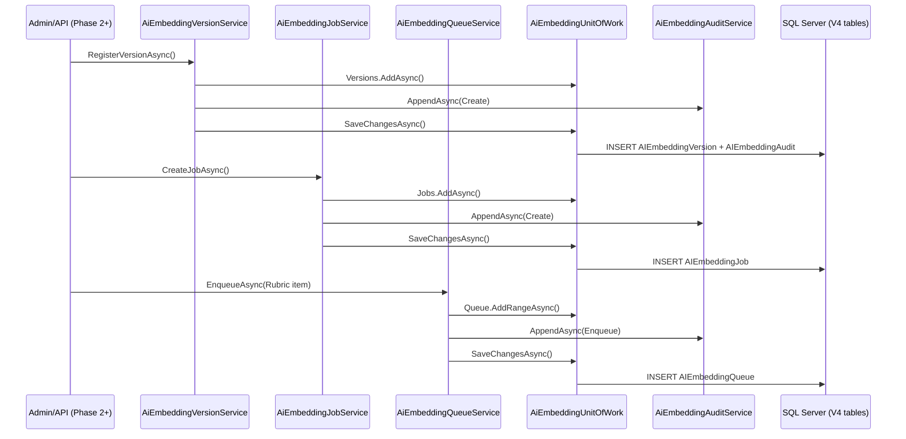
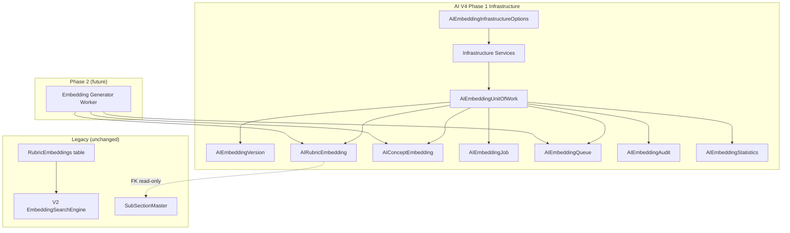

# HomeoCentrum AI V4 — Phase 1: Enterprise Embedding Infrastructure

Phase 1 delivers **database schema, entities, repositories, services, and configuration only**.  
It does **not** implement embedding generation, AI rubric selection, or repertorization changes.

## Backward compatibility

| Component | Phase 1 behavior |
|-----------|------------------|
| `dbo.SubSectionMaster`, `SectionMaster`, remedy masters | **Not modified** |
| Legacy `dbo.RubricEmbeddings` (V2) | **Unchanged** — remains active via `KeepLegacyRubricEmbeddingsActive: true` |
| V2/V3 AI pipelines | **Not modified** — no calls to V4 tables yet |

---

## 1. Database schema

Script: `Database/Scripts/AIV4EmbeddingInfrastructure/801_Create_AIEmbeddingInfrastructure.sql`

| Table | Purpose |
|-------|---------|
| `AIEmbeddingVersion` | Model/version registry (provider, dimensions, current flag) |
| `AIRubricEmbedding` | Versioned rubric vectors (FK → `SubSectionMaster` read-only) |
| `AIConceptEmbedding` | Versioned concept vectors (no master FK) |
| `AIEmbeddingJob` | Batch/index job metadata |
| `AIEmbeddingQueue` | Retryable work queue with lock + backoff |
| `AIEmbeddingAudit` | Append-only audit trail |
| `AIEmbeddingStatistics` | Daily aggregated metrics per version |

### Cross-cutting columns

- **Versioning:** `EmbeddingVersionId`, `RevisionNo`, `IsCurrent`
- **Soft delete:** `IsDeleted`, `DeletedDate` (versions, embeddings, jobs, queue)
- **Status:** `Status` on all mutable entities
- **Timestamps:** `CreatedDate`, `UpdatedDate` (+ job `StartedAtUtc` / `CompletedAtUtc`)
- **Retry:** `AttemptCount`, `MaxAttempts`, `NextRetryAtUtc`, `RetryCount`, `MaxRetries`

---

## 2. Entity models

File: `Niga-Domain/Master/AiEmbeddingInfrastructureEntities.cs`

Registered in `NIGACentrumContext` with explicit table/constraint names matching SQL.

---

## 3. Repository interfaces

File: `Niga-Domain/Interfaces/AiEmbeddingInfrastructureInterfaces.cs`

- `IAiEmbeddingVersionRepository`
- `IAiRubricEmbeddingRepository` (V4 `AIRubricEmbedding` — distinct from legacy `IRubricEmbeddingRepository`)
- `IAiConceptEmbeddingRepository`
- `IAiEmbeddingJobRepository`
- `IAiEmbeddingQueueRepository`
- `IAiEmbeddingAuditRepository`
- `IAiEmbeddingStatisticsRepository`
- `IAiEmbeddingUnitOfWork` (Unit of Work over shared `DbContext`)

---

## 4. Repository implementations

File: `Niga-Domain/Repositories/AiEmbeddingInfrastructure/AiEmbeddingInfrastructureRepositories.cs`

Includes `AiEmbeddingUnitOfWork` and `AiEmbeddingHashHelper` (SHA-256 for incremental change detection).

---

## 5. Services (infrastructure only)

| Service | Responsibility |
|---------|----------------|
| `AiEmbeddingVersionService` | Register / activate versions |
| `AiEmbeddingJobService` | Create jobs, status transitions |
| `AiEmbeddingQueueService` | Enqueue, dequeue (lock), complete, fail + retry |
| `AiEmbeddingAuditService` | Append audit rows |
| `AiEmbeddingStatisticsService` | Daily snapshot upsert |
| `AiEmbeddingInfrastructureService` | Health/status dashboard DTO |
| `AiEmbeddingRetryPolicy` | Exponential backoff (no API calls) |

Folder: `Niga-Domain/Services/AiEmbeddingInfrastructure/`

---

## 6. DTOs & configuration

- DTOs: `Niga-Domain/DTOs/AiEmbeddingInfrastructureModels.cs`
- Options: `Niga-Domain/Configuration/AiEmbeddingInfrastructureOptions.cs`
- App config section: `AiEmbeddingInfrastructure` in `appsettings.json`

---

## 7. Migration / deploy

```text
1. Run 801_Create_AIEmbeddingInfrastructure.sql on target DB (SSMS)
2. Deploy API with updated Niga-Domain + Niga-Web
3. Merge AiEmbeddingInfrastructure appsettings on production server
4. Phase 2 will add embedding workers (not in this phase)
```

Entry pointer: `000_DEPLOY_V4_EMBEDDING_INFRA_PHASE1.sql`

---

## 8. Sequence diagram — enqueue job (Phase 1)



---

## 9. Architecture diagram



---

## 10. Unit test plan

### Implemented (Phase 1)

| Test class | Coverage |
|------------|----------|
| `AiEmbeddingRetryPolicyTests` | Backoff, retry limits, dead-letter status |

### Planned (Phase 1.1 — integration with test DB)

| Area | Tests |
|------|-------|
| `AiEmbeddingVersionRepository` | Register duplicate VersionCode rejected; SetCurrentAsync clears previous |
| `AiEmbeddingQueueRepository` | DequeueBatchAsync locks items; respects `NextRetryAtUtc` |
| `AiEmbeddingQueueService` | MarkFailedAsync requeues vs dead-letter at max attempts |
| `AiEmbeddingJobService` | Status transitions write audit rows |
| `AiEmbeddingStatisticsService` | Upsert same date updates counts |
| `AiEmbeddingUnitOfWork` | Single SaveChanges persists version + audit atomically |

### Planned (Phase 2 — with generator)

| Area | Tests |
|------|-------|
| Incremental indexing | TextHash change creates new revision, supersedes old |
| End-to-end job | Job completes when queue empty |
| Legacy coexistence | V2 search still reads `RubricEmbeddings` when flag true |

---

## DI registration

`ApplicationServiceExtensions.AddApplicationServices`:

```csharp
services.Configure<AiEmbeddingInfrastructureOptions>(...);
services.AddScoped<IAiEmbeddingUnitOfWork, AiEmbeddingUnitOfWork>();
services.AddScoped<IAiEmbeddingVersionService, AiEmbeddingVersionService>();
// ... Job, Queue, Audit, Statistics, Infrastructure
```

---

## SOLID mapping

| Principle | Application |
|-----------|-------------|
| **S** | Separate repositories per aggregate; services per concern |
| **O** | Phase 2 adds generator without changing repository contracts |
| **L** | Interfaces allow mock implementations in tests |
| **I** | Segregated repos (not one god repository) |
| **D** | Services depend on `IAiEmbeddingUnitOfWork` + options interfaces |

---

## File index

```text
Database/Scripts/AIV4EmbeddingInfrastructure/
  801_Create_AIEmbeddingInfrastructure.sql
  000_DEPLOY_V4_EMBEDDING_INFRA_PHASE1.sql

Niga-Domain/
  Master/AiEmbeddingInfrastructureEntities.cs
  DTOs/AiEmbeddingInfrastructureModels.cs
  Configuration/AiEmbeddingInfrastructureOptions.cs
  Interfaces/AiEmbeddingInfrastructureInterfaces.cs
  Repositories/AiEmbeddingInfrastructure/AiEmbeddingInfrastructureRepositories.cs
  Services/AiEmbeddingInfrastructure/
    AiEmbeddingRetryPolicy.cs
    AiEmbeddingInfrastructureServices.cs

Niga-Domain.Tests/AiEmbeddingInfrastructure/
  AiEmbeddingRetryPolicyTests.cs
```
